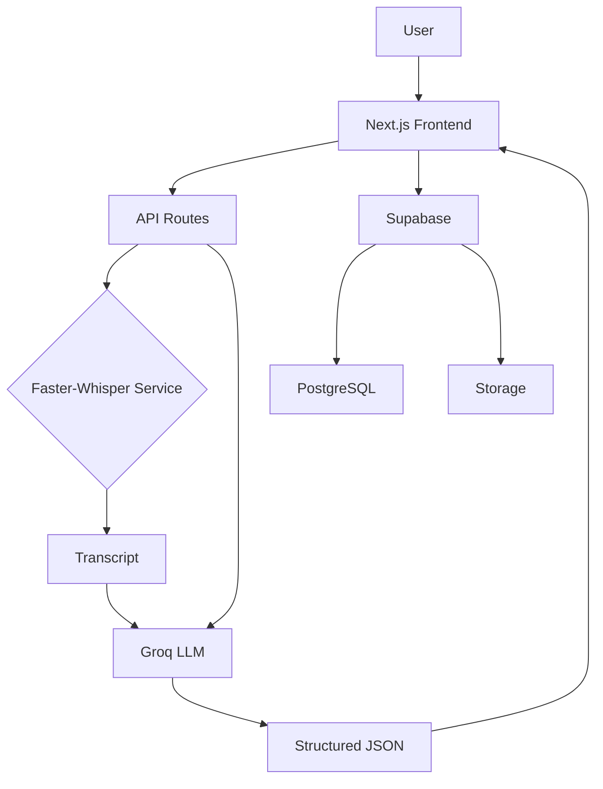
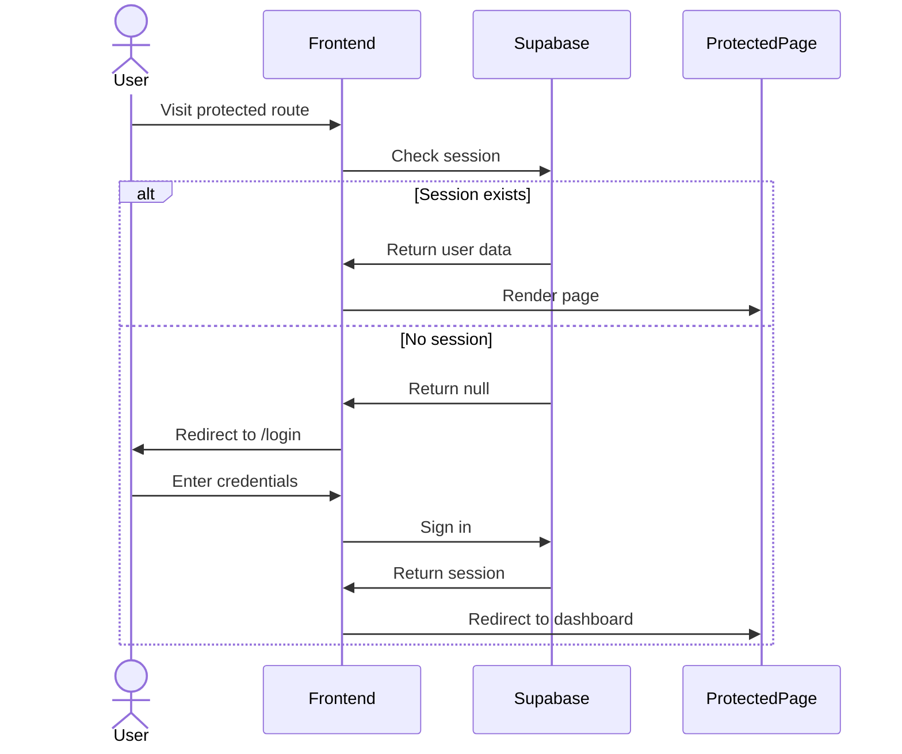
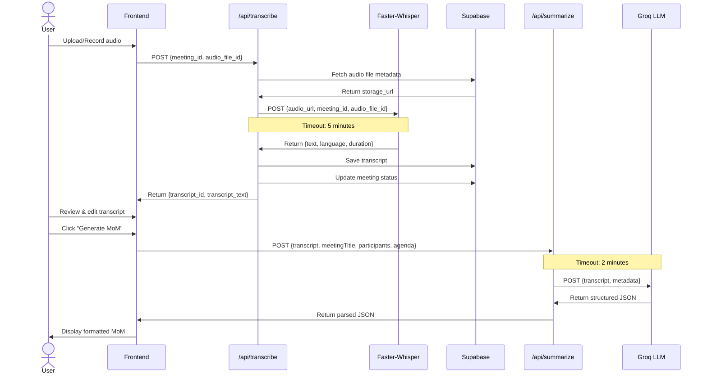
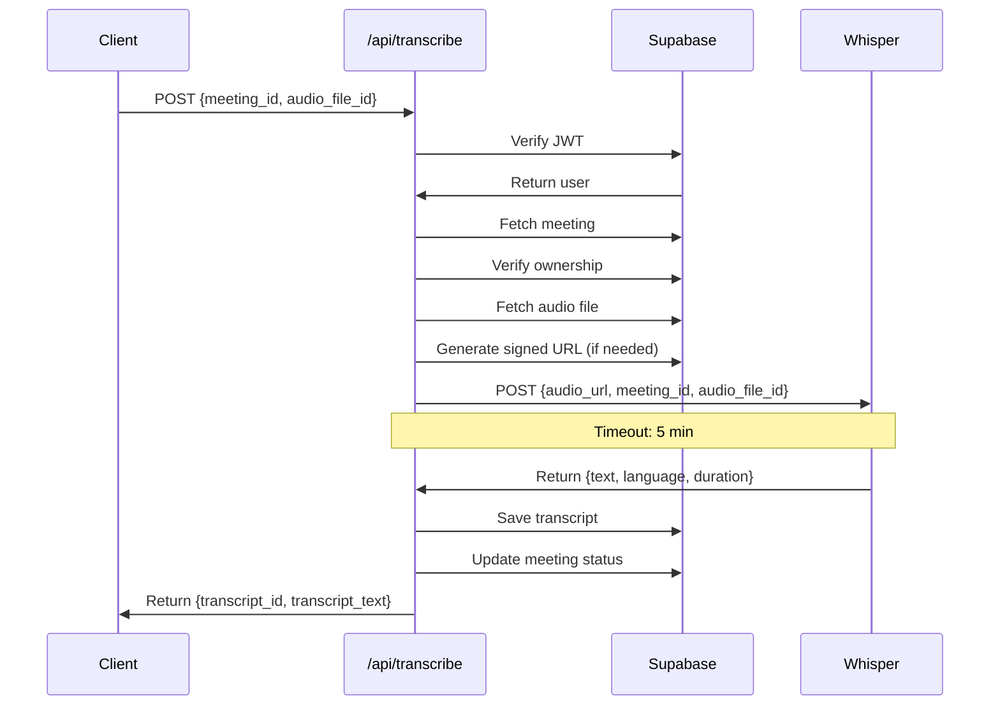
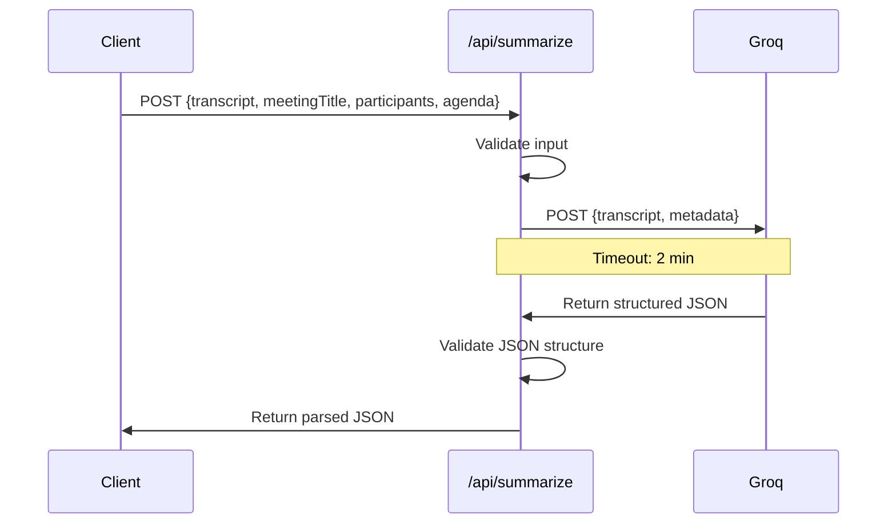
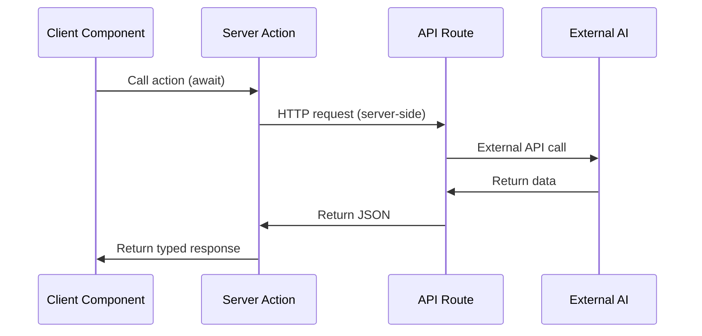
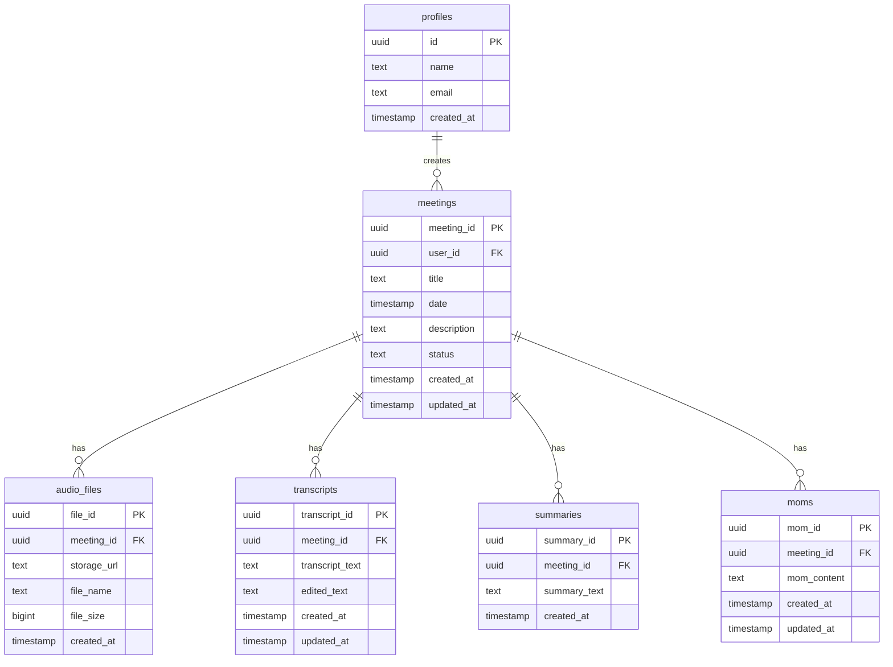
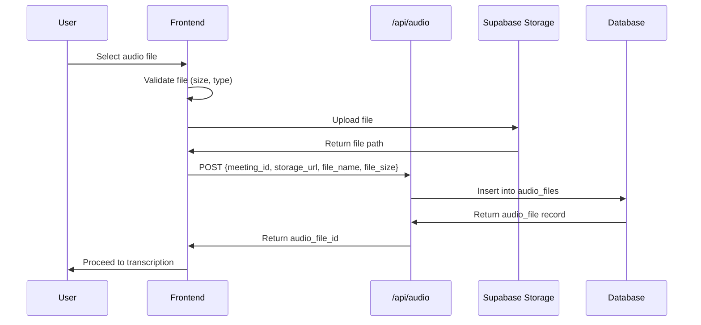
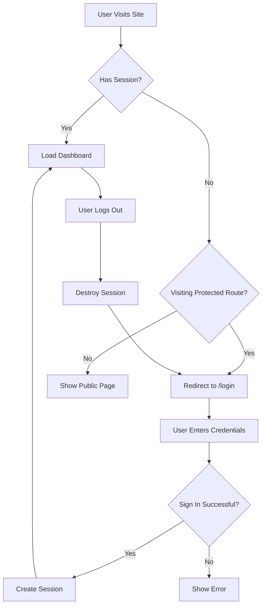
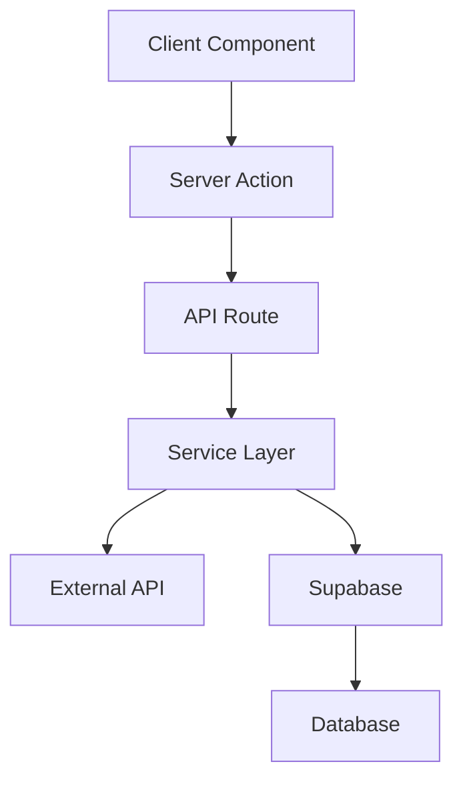

# MoM Generator - Technical Walkthrough

> **Official Technical Documentation for Developers**
> 
> This document provides a comprehensive understanding of the MoM Generator system, its architecture, and implementation details. It is intended for engineers joining the team and serves as the definitive source of truth for how the system works.

---

## Table of Contents

1. [Project Overview](#1-project-overview)
2. [Current Architecture](#2-current-architecture)
3. [Technology Stack](#3-technology-stack)
4. [Project Structure](#4-project-structure)
5. [Complete User Flow](#5-complete-user-flow)
6. [AI Pipeline](#6-ai-pipeline)
7. [AI Layer](#7-ai-layer)
8. [API Routes](#8-api-routes)
9. [Server Actions](#9-server-actions)
10. [Database](#10-database)
11. [Storage](#11-storage)
12. [Authentication](#12-authentication)
13. [Validation Layer](#13-validation-layer)
14. [Service Layer](#14-service-layer)
15. [Error Handling](#15-error-handling)
16. [Environment Variables](#16-environment-variables)
17. [Local Development](#17-local-development)
18. [Deployment](#18-deployment)
19. [Current Project Status](#19-current-project-status)
20. [Future Roadmap](#20-future-roadmap)
21. [Contribution Guide](#21-contribution-guide)
22. [Architecture Decisions](#22-architecture-decisions)

---

## 1. Project Overview

### What It Is

MoM Generator is an AI-powered application that transforms meeting audio into structured Minutes of Meeting (MoM) documents. It automates the tedious process of note-taking by recording or uploading meeting audio, transcribing it to text, and using artificial intelligence to generate comprehensive meeting summaries.

### Why It Exists

Traditional meeting documentation requires manual note-taking, which is:
- **Time-consuming** - Developers spend 30-60 minutes post-meeting documenting discussions
- **Inconsistent** - Different noters capture different details
- **Error-prone** - Important decisions or action items get lost
- **Delayed** - MoM distribution happens days after the meeting

MoM Generator solves these problems by providing instant, consistent, and comprehensive meeting documentation.

### Problems It Solves

1. **Manual transcription overhead** - Eliminates the need for manual note-taking during meetings
2. **Inconsistent documentation** - Ensures all meetings follow the same structured format
3. **Lost action items** - AI automatically extracts and highlights action items with assignees
4. **Decision tracking** - Captures decisions made during meetings with context
5. **Knowledge retention** - Creates searchable, structured records of all meetings

### Key Features

- **Audio Recording** - Record meetings directly in the browser using the MediaRecorder API
- **File Upload** - Upload pre-recorded audio files (MP3, WAV, M4A, OGG)
- **AI Transcription** - Convert speech to text using Faster-Whisper (local, privacy-focused)
- **AI Summarization** - Generate structured MoM using Groq LLM
- **Editable Transcripts** - Review and correct transcripts before MoM generation
- **Structured Output** - Executive summary, highlights, decisions, action items, risks, SOP
- **Meeting Dashboard** - View all meetings with status tracking
- **Export Ready** - Copy MoM to clipboard for sharing

### High-Level Architecture



---

## 2. Current Architecture

### System Components

The application follows a **three-tier architecture** with clear separation of concerns:

```
┌─────────────────────────────────────────────────────────────┐
│                         CLIENT LAYER                        │
│                    (Next.js 16 + React 19)                  │
│  ┌──────────────┐  ┌──────────────┐  ┌──────────────────┐  │
│  │   Pages      │  │  Components  │  │  Server Actions  │  │
│  │  (App Router)│  │  (shadcn/ui) │  │  ("use server")  │  │
│  └──────────────┘  └──────────────┘  └──────────────────┘  │
└─────────────────────────────────────────────────────────────┘
                            │
                            │ HTTP Requests
                            ▼
┌─────────────────────────────────────────────────────────────┐
│                      API ROUTE LAYER                         │
│                    (Next.js API Routes)                      │
│  ┌──────────────┐  ┌──────────────┐  ┌──────────────────┐  │
│  │ /transcribe  │  │ /summarize   │  │  /api/*          │  │
│  │   (POST)     │  │   (POST)     │  │                  │  │
│  └──────────────┘  └──────────────┘  └──────────────────┘  │
└─────────────────────────────────────────────────────────────┘
                            │
                            │ API Calls
                            ▼
┌─────────────────────────────────────────────────────────────┐
│                        AI LAYER                              │
│                  (src/lib/ai/)                               │
│  ┌─────────────────┐      ┌──────────────────────┐         │
│  │  transcription   │      │  groq (summarization)│         │
│  │   (whisper.ts)   │─────▶│   (groq.ts)          │         │
│  └─────────────────┘      └──────────────────────┘         │
└─────────────────────────────────────────────────────────────┘
                            │
                            │ Service Communication
                            ▼
┌─────────────────────────────────────────────────────────────┐
│                    EXTERNAL SERVICES                         │
│  ┌──────────────────────┐      ┌──────────────────────┐    │
│  │  Faster-Whisper      │      │       Groq           │    │
│  │  (Speech-to-Text)    │      │   (LLM Inference)    │    │
│  │  Port: 8000          │      │   API Key Required   │    │
│  └──────────────────────┘      └──────────────────────┘    │
└─────────────────────────────────────────────────────────────┘
                            │
                            │ Data Persistence
                            ▼
┌─────────────────────────────────────────────────────────────┐
│                      SUPABASE LAYER                          │
│  ┌──────────────┐  ┌──────────────┐  ┌──────────────────┐  │
│  │    Auth      │  │  PostgresDB  │  │    Storage       │  │
│  │  (Email/OAuth)│  │   (6 tables) │  │ (Audio files)    │  │
│  └──────────────┘  └──────────────┘  └──────────────────┘  │
└─────────────────────────────────────────────────────────────┘
```

### Layer Responsibilities

#### 1. Client Layer
- **Pages** - Route handlers using App Router
- **Components** - Reusable UI built with shadcn/ui
- **Server Actions** - Server-side functions called from client components
- **State Management** - React Context for meeting flow state

**Responsibility**: User interface, user interactions, client-side validation

#### 2. API Route Layer
- `/api/transcribe` - Audio transcription orchestration
- `/api/summarize` - MoM generation orchestration
- `/api/meetings`, `/api/audio`, etc. - Data CRUD operations

**Responsibility**: Authentication, request validation, orchestration, response formatting

#### 3. AI Layer
- `transcription.ts` - Whisper service communication
- `groq.ts` - Groq LLM communication
- `summarization.ts` - Summarization orchestration
- `whisper.ts` - Whisper module exports

**Responsibility**: Abstract AI provider communication, handle timeouts, format requests/responses

#### 4. External Services
- **Faster-Whisper** - Local speech-to-text service
- **Groq** - LLM inference for summarization

**Responsibility**: Actual AI computation (outside this codebase)

#### 5. Supabase Layer
- **PostgreSQL** - Metadata storage (meetings, transcripts, summaries, MoMs)
- **Storage** - Audio file storage
- **Auth** - User authentication and authorization

**Responsibility**: Data persistence, authentication, file storage

---

## 3. Technology Stack

### Core Framework

| Technology | Version | Why We Chose It | Responsibility |
|------------|---------|-----------------|----------------|
| **Next.js** | 16.2.6 | Modern React framework with App Router, SSR, API routes, and built-in optimizations | Full-stack application framework |
| **React** | 19.2.4 | Latest React with concurrent features and improved performance | UI library |
| **TypeScript** | 5.x | Type safety, better DX, fewer runtime errors | Type system |
| **Bun** | Latest | Fast package manager and runtime, used as lockfile source of truth | Package management |

### Styling & UI

| Technology | Version | Why We Chose It | Responsibility |
|------------|---------|-----------------|----------------|
| **Tailwind CSS** | v4 | Utility-first CSS, rapid UI development, consistent design | Styling framework |
| **shadcn/ui** | Latest | Pre-built accessible components (Radix UI), customizable, minimal aesthetic | UI component library |
| **Framer Motion** | 12.x | Smooth animations and transitions | Animation library |

### Backend & Data

| Technology | Version | Why We Chose It | Responsibility |
|------------|---------|-----------------|----------------|
| **Supabase** | Latest | Open-source Firebase alternative, PostgreSQL-based, built-in auth | Backend-as-a-Service |
| **@supabase/ssr** | 0.10.x | Server-side rendering support for Supabase | SSR client helpers |

### AI Services

| Technology | Why We Chose It | Responsibility |
|------------|-----------------|----------------|
| **Faster-Whisper** | Local, privacy-focused, high-accuracy speech-to-text, no API costs | Speech-to-text transcription |
| **Groq** | Fast LLM inference, generous free tier, OpenAI-compatible API | Meeting summarization and MoM generation |

### Development Tools

| Technology | Why We Chose It | Responsibility |
|------------|-----------------|----------------|
| **Biome** | Fast linter/formatter, single tool for both | Code quality |
| **Lucide React** | Consistent icon set | Icons |

---

## 4. Project Structure

```
MoM/
├── .env.example                 # Environment variable template
├── AGENTS.md                    # AI agent rules and constraints
├── README.md                    # Project overview and setup guide
├── walkthrough.md               # This document - technical documentation
├── implementation.md            # Implementation plan and phases
├── package.json                 # Dependencies and scripts
├── tsconfig.json                # TypeScript configuration
├── next.config.ts               # Next.js configuration
├── biome.json                   # Biome linter config
├── postcss.config.mjs           # PostCSS config for Tailwind
├── components.json              # shadcn/ui component registry
│
├── public/                      # Static assets
│   ├── FCLogo.svg
│   └── FCLogoSquareCentered.svg
│
├── docs/                        # Additional documentation
│   ├── MoM_Planning_Document.md
│   ├── project_planning_document.md
│   ├── extracted_planning_doc.txt
│   └── guides/
│       └── shadcn.md
│
├── services/                    # External services (planned)
│   └── transcription/           # Faster-Whisper service (separate codebase)
│
└── src/                         # Application source code
    ├── app/                     # Next.js App Router
    │   ├── layout.tsx           # Root layout (fonts, theme)
    │   ├── page.tsx             # Landing page / redirect
    │   ├── (auth)/              # Auth route group (no sidebar)
    │   │   ├── layout.tsx
    │   │   └── login/
    │   │       └── page.tsx
    │   ├── (app)/               # Authenticated app route group
    │   │   ├── layout.tsx       # App layout with sidebar
    │   │   ├── dashboard/
    │   │   │   └── page.tsx     # Meeting list dashboard
    │   │   └── meetings/
    │   │       ├── new/
    │   │       │   └── page.tsx # Create new meeting
    │   │       └── [id]/
    │   │           ├── page.tsx # Meeting detail view
    │   │           ├── record/
    │   │           │   └── page.tsx # Audio recording/upload
    │   │           ├── transcript/
    │   │           │   └── page.tsx # Transcript review
    │   │           └── mom/
    │   │               └── page.tsx # MoM viewer
    │   └── api/                 # API routes
    │       ├── transcribe/
    │       │   └── route.ts     # POST - Transcription orchestration
    │       ├── summarize/
    │       │   └── route.ts     # POST - MoM generation
    │       ├── meetings/
    │       │   └── route.ts     # CRUD for meetings
    │       ├── audio/
    │       │   └── route.ts     # Audio file metadata
    │       ├── transcripts/
    │       │   └── route.ts     # Transcript management
    │       └── summaries/
    │           └── route.ts     # Summary storage
    │
    ├── actions/                 # Server Actions
    │   ├── transcribe.ts        # Trigger transcription
    │   └── generate-mom.ts      # Trigger MoM generation
    │
    ├── components/              # React components
    │   ├── ui/                  # shadcn/ui components
    │   │   ├── button.tsx
    │   │   ├── input.tsx
    │   │   ├── textarea.tsx
    │   │   ├── card.tsx
    │   │   ├── progress.tsx
    │   │   ├── badge.tsx
    │   │   └── ... (other shadcn components)
    │   ├── dashboard/
    │   │   ├── status-badge.tsx
    │   │   └── meeting-list.tsx
    │   ├── meeting/
    │   │   ├── meeting-context.tsx  # React Context for meeting state
    │   │   └── mom-renderer.tsx     # Markdown renderer for MoM
    │   └── layout/
    │       └── app-sidebar.tsx
    │
    ├── hooks/                   # Custom React hooks
    │   ├── use-audio-recorder.ts # MediaRecorder wrapper
    │   └── use-mobile.ts         # Mobile detection
    │
    ├── lib/                     # Utilities and services
    │   ├── utils.ts             # cn() helper for classnames
    │   ├── mock-data.ts         # Mock data for development
    │   ├── supabase/            # Supabase clients
    │   │   ├── client.ts        # Browser client
    │   │   └── server.ts        # Server client
    │   ├── types/               # TypeScript type definitions
    │   │   ├── database.ts      # Supabase database schema types
    │   │   └── meeting.ts       # Meeting-related types
    │   └── ai/                  # AI abstraction layer
    │       ├── index.ts         # Barrel exports
    │       ├── transcription.ts # Whisper service client
    │       ├── whisper.ts       # Whisper module exports
    │       ├── groq.ts          # Groq LLM client
    │       └── summarization.ts # Summarization module exports
    │
    └── styles/                  # DO NOT MODIFY
        ├── globals.css          # Active global styles
        ├── globals_claude.css   # Alternate theme (reference)
        └── globals_fc.css       # Alternate theme (reference)
```

---

## 5. Complete User Flow

### End-to-End Flow

```mermaid
flowchart TD
    A[User Lands on App] --> B{Authenticated?}
    B -->|No| C[Login / Signup]
    C --> D[Supabase Auth]
    D --> E[Dashboard]
    B -->|Yes| E
    
    E --> F[Click "New Meeting"]
    F --> G[Meeting Details Form]
    G --> H{Valid Input?}
    H -->|No| G
    H -->|Yes| I[Audio Input Step]
    
    I --> J{Choose Input Mode}
    J -->|Record| K[Browser Recording]
    J -->|Upload| L[File Upload]
    
    K --> M{Stop Recording}
    L --> N{File Selected}
    M --> O[Save to Supabase Storage]
    N --> O
    
    O --> P[Transcription Step]
    P --> Q[POST /api/transcribe]
    Q --> R{Whisper Service\nAvailable?}
    R -->|No| S[503 Error\nUser-friendly message]
    R -->|Yes| T[Transcribe Audio]
    T --> U[Save Transcript to DB]
    U --> V[Update Meeting Status]
    
    V --> W[Transcript Review]
    W --> X[User Edits Transcript]
    X --> Y{Proceed?}
    Y -->|No| X
    Y -->|Yes| Z[Generate MoM Step]
    
    Z --> AA[POST /api/summarize]
    AA --> AB{Groq Service\nAvailable?}
    AB -->|No| AC[502 Error\nUser-friendly message]
    AB -->|Yes| AD[Generate Structured Summary]
    AD --> AE[Parse JSON Response]
    AE --> AF[Format MoM Document]
    
    AF --> AG[Display MoM]
    AG --> AH{User Action}
    AH -->|Edit| AI[Edit MoM]
    AH -->|Copy| AJ[Copy to Clipboard]
    AH -->|Save| AK[Return to Dashboard]
    
    AI --> AG
    AJ --> AG
    AK --> AL[Update Meeting Status\nto "completed"]
    AL --> AM[Dashboard with\nUpdated Meeting List]
```

### Detailed Flow Explanation

#### 1. Authentication Flow



#### 2. Meeting Creation Flow

1. **Dashboard** - User sees list of meetings or empty state
2. **New Meeting Form** - User enters title, date, participants, agenda
3. **Audio Input** - User chooses recording or upload mode
4. **Processing** - Audio saved to Supabase Storage
5. **Transcription** - Automatic transcription via Faster-Whisper
6. **Review** - User reviews and edits transcript
7. **MoM Generation** - AI generates structured MoM
8. **Save** - User saves MoM to archive

#### 3. State Management

The app uses React Context (`MeetingProvider`) to share state across the multi-step meeting creation wizard:

```typescript
interface MeetingContextType {
  meetingForm: MeetingForm | null;      // Step 1 form data
  setMeetingForm: (form) => void;
  meetingData: MeetingForm | null;      // Combined data from all steps
  setMeetingData: (data) => void;
  meetingId: string | null;             // UUID for current meeting
  getOrCreateMeetingId: () => string;
}
```

This allows each step to build on previous data without prop drilling.

---

## 6. AI Pipeline

### Overview

The AI pipeline is a **two-stage process** that transforms raw audio into structured meeting documentation:

```
Audio File
    ↓
[Stage 1: Speech-to-Text]
Faster-Whisper Service
    ↓
Raw Transcript
    ↓
[Stage 2: Understanding & Summarization]
Groq LLM
    ↓
Structured JSON
    ↓
Frontend Rendering
```

### Why This Architecture

#### Separation of Concerns

**Faster-Whisper handles ONLY transcription because:**
- It's optimized for speech-to-text accuracy
- It detects language automatically
- It's cost-free (local service)
- It returns clean text output

**Groq handles ONLY summarization because:**
- It understands context and extracts meaning
- It structures information into standard formats
- It identifies key elements (decisions, action items, risks)
- It generates professional documentation

#### Why Not Combine?

Combining transcription and summarization in a single LLM call would:
1. **Increase cost** - LLM tokens for raw audio transcription are expensive
2. **Reduce accuracy** - Whisper is specifically trained for speech-to-text
3. **Limit flexibility** - Can't edit transcript before summarization
4. **Violate single responsibility** - Mixing concerns

#### Why Not Send Audio to Groq?

- **Privacy** - Audio contains sensitive conversation data
- **Cost** - Audio files are large, transcription via LLM is expensive
- **Performance** - Whisper is optimized for transcription speed
- **Accuracy** - Specialized STT models outperform general LLMs

### Detailed Pipeline



### Data Flow

#### Stage 1: Transcription

**Input:**
- Audio file URL (from Supabase Storage)
- Meeting ID
- Audio file ID

**Processing:**
1. API route validates authentication
2. Fetches audio file metadata from database
3. Generates signed URL if needed
4. Calls Faster-Whisper service with 5-minute timeout
5. Receives transcript text, language, duration
6. Saves transcript to database
7. Updates meeting status to "transcribed"

**Output:**
```json
{
  "transcript_id": "uuid",
  "meeting_id": "uuid",
  "transcript_text": "Raw transcript text..."
}
```

#### Stage 2: Summarization

**Input:**
- Transcript text (never raw audio)
- Meeting title
- Participants
- Agenda

**Processing:**
1. API route validates input
2. Constructs prompt with transcript and metadata
3. Calls Groq LLM with 2-minute timeout
4. Receives JSON response
5. Validates JSON structure
6. Returns parsed structured data

**Output:**
```json
{
  "executive_summary": "Brief 2-3 sentence overview...",
  "meeting_summary": "Detailed discussion summary...",
  "highlights": ["Key point 1", "Key point 2", ...],
  "decisions": ["Decision 1", "Decision 2", ...],
  "action_items": [
    {
      "task": "Task description",
      "owner": "Person responsible",
      "deadline": "2024-01-15"
    }
  ],
  "risks": ["Risk 1", "Risk 2", ...],
  "sop": ["Step 1", "Step 2", ...]
}
```

### Error Handling

**Faster-Whisper errors:**
- **503 Service Unavailable** - Whisper service down or unreachable
- **504 Gateway Timeout** - Request exceeded 5-minute timeout
- **400 Bad Request** - Invalid audio URL or format

**Groq errors:**
- **502 Bad Gateway** - Groq API error or rate limit (429)
- **504 Gateway Timeout** - Request exceeded 2-minute timeout
- **400 Bad Request** - Invalid transcript or missing metadata

**User-facing errors are always friendly:**
- "Unable to connect to the transcription service. Please try again later."
- "AI service temporarily unavailable. Please try again later."

Technical details are logged server-side only.

---

## 7. AI Layer

### Purpose

The AI layer (`src/lib/ai/`) abstracts all communication with external AI services. It provides a clean interface for the rest of the application to consume AI capabilities without knowing implementation details.

### Structure

```
src/lib/ai/
├── index.ts           # Barrel exports for clean imports
├── transcription.ts   # Whisper service client
├── whisper.ts         # Whisper module exports
├── groq.ts            # Groq LLM client
└── summarization.ts   # Summarization module exports
```

### Module Responsibilities

#### transcription.ts

**Purpose:** Handles ALL communication with the Faster-Whisper service.

**Responsibilities:**
- Validates `WHISPER_SERVICE_URL` environment variable
- Constructs POST request with audio URL, meeting ID, audio file ID
- Implements 5-minute timeout using AbortController
- Parses response and extracts transcript text
- Returns structured `TranscriptionResponse` object

**Interface:**
```typescript
export interface TranscriptionResponse {
  transcript: string;
  language: string;
  duration?: number;
}

export async function transcribeAudio(
  audioUrl: string,
  meetingId: string,
  audioFileId: string
): Promise<TranscriptionResponse>
```

**Error Handling:**
- Throws "Transcription service configuration error" if `WHISPER_SERVICE_URL` is missing
- Throws "Transcription service temporarily unavailable" on 503
- Throws "Transcription request timed out" on AbortError
- Logs technical details server-side

#### whisper.ts

**Purpose:** Re-exports transcription module for cleaner imports.

**Exports:**
```typescript
export { transcribeAudio } from "./transcription";
export type { TranscriptionResponse } from "./transcription";
```

**Usage:**
```typescript
import { transcribeAudio } from "@/lib/ai/whisper";
```

#### groq.ts

**Purpose:** Handles ALL communication with the Groq LLM API.

**Responsibilities:**
- Validates `GROQ_API_KEY` environment variable
- Constructs chat completion request with system and user prompts
- Enforces strict JSON output via system prompt and `response_format: "json_object"`
- Implements 2-minute timeout using AbortController
- Parses and validates JSON response structure
- Returns typed `StructuredOutput` object

**Interface:**
```typescript
export interface SummarizeInput {
  transcript: string;
  meetingTitle: string;
  participants: string;
  agenda: string;
}

export interface StructuredOutput {
  executive_summary: string;
  meeting_summary: string;
  highlights: string[];
  decisions: string[];
  action_items: Array<{
    task: string;
    owner: string;
    deadline?: string;
  }>;
  risks: string[];
  sop: string[];
}

export async function generateSummary(input: SummarizeInput): Promise<StructuredOutput>
```

**Prompt Engineering:**
The system prompt explicitly instructs the LLM to:
- Return ONLY valid JSON
- Not include markdown or extra text
- Match exact schema requirements

**Response Validation:**
Validates:
- `executive_summary` is present and is a string
- `meeting_summary` is present and is a string
- `highlights` is an array
- All required fields exist

**Error Handling:**
- Throws "AI service rate limit reached" on 429
- Throws "AI service request timed out" on AbortError
- Throws "Invalid response format from AI service" on parse failure
- Logs technical details server-side

#### summarization.ts

**Purpose:** Re-exports Groq module for cleaner imports.

**Exports:**
```typescript
export { generateSummary } from "./groq";
export type { SummarizeInput, StructuredOutput } from "./groq";
```

**Usage:**
```typescript
import { generateSummary } from "@/lib/ai/summarization";
```

#### index.ts

**Purpose:** Barrel export for all AI modules.

**Exports:**
```typescript
export { transcribeAudio } from "./transcription";
export type { TranscriptionResponse } from "./transcription";

export { generateSummary } from "./groq";
export type { SummarizeInput, StructuredOutput } from "./groq";
```

**Usage:**
```typescript
import { transcribeAudio, generateSummary } from "@/lib/ai";
```

---

## 8. API Routes

### /api/transcribe

**Method:** POST  
**Auth:** Required (Supabase JWT)  
**Purpose:** Orchestrates audio transcription via Faster-Whisper

#### Request

**Headers:**
```
Content-Type: application/json
Authorization: Bearer <supabase_jwt>
```

**Body:**
```json
{
  "meeting_id": "uuid",
  "audio_file_id": "uuid"
}
```

**Validation:**
- `meeting_id` is required
- `audio_file_id` is required
- User must own the meeting
- Audio file must exist in database

#### Response

**Success (200):**
```json
{
  "transcript_id": "uuid",
  "meeting_id": "uuid",
  "transcript_text": "Transcribed text..."
}
```

**Error Responses:**

| Status | Condition | Message |
|--------|-----------|---------|
| 401 | Not authenticated | "Unauthorized" |
| 403 | Not meeting owner | "Forbidden" |
| 404 | Meeting or audio not found | "Meeting not found" / "Audio file not found" |
| 500 | Database error | Error message |
| 503 | Whisper service unavailable | "Unable to connect to the transcription service. Please try again later." |

#### Flow



#### Error Handling

```typescript
try {
  const transcription = await transcribeAudio(audioUrl, meeting_id, audio_file_id);
  // Save to DB...
  return NextResponse.json({...});
} catch (error) {
  console.error("Transcription error:", error); // Server-side only
  return NextResponse.json(
    { error: "Unable to connect to the transcription service. Please try again later." },
    { status: 503 }
  );
}
```

---

### /api/summarize

**Method:** POST  
**Auth:** Required (Supabase JWT)  
**Purpose:** Generates structured MoM from transcript using Groq LLM

#### Request

**Headers:**
```
Content-Type: application/json
Authorization: Bearer <supabase_jwt>
```

**Body:**
```json
{
  "transcript": "Full transcript text...",
  "meetingTitle": "Q4 Planning",
  "participants": "Alice, Bob, Charlie",
  "agenda": "Q4 planning, budget review"
}
```

**Validation:**
- `transcript` is required and non-empty
- `meetingTitle` is required
- `participants` is required
- `agenda` is required

#### Response

**Success (200):**
```json
{
  "executive_summary": "Brief overview...",
  "meeting_summary": "Detailed summary...",
  "highlights": ["Point 1", "Point 2", "Point 3"],
  "decisions": ["Decision 1", "Decision 2"],
  "action_items": [
    {
      "task": "Follow up with vendor",
      "owner": "Alice",
      "deadline": "2024-01-15"
    }
  ],
  "risks": ["Risk 1", "Risk 2"],
  "sop": ["Step 1", "Step 2", "Step 3"]
}
```

**Error Responses:**

| Status | Condition | Message |
|--------|-----------|---------|
| 401 | Not authenticated | "Unauthorized" |
| 400 | Missing required fields | Validation error |
| 502 | Groq API error | "Unable to generate meeting summary. Please try again later." |

#### Flow



#### Error Handling

```typescript
try {
  const structured = await generateSummary({
    transcript,
    meetingTitle,
    participants,
    agenda
  });
  return NextResponse.json(structured);
} catch (error) {
  console.error("Summarization error:", error); // Server-side only
  return NextResponse.json(
    { error: "Unable to generate meeting summary. Please try again later." },
    { status: 502 }
  );
}
```

---

### Other API Routes

#### /api/meetings

**Method:** POST  
**Purpose:** Create a new meeting  
**Auth:** Required

#### /api/audio

**Method:** POST  
**Purpose:** Save audio file metadata  
**Auth:** Required

#### /api/transcripts

**Method:** GET, POST  
**Purpose:** Retrieve or create transcripts  
**Auth:** Required

#### /api/summaries

**Method:** POST  
**Purpose:** Save summary to database  
**Auth:** Required

---

## 9. Server Actions

### What Are Server Actions?

Server Actions are asynchronous functions that run on the server but can be called directly from client components. They eliminate the need for separate API route handlers for many use cases.

**Why We Use Them:**
- **Simplified data fetching** - Call server functions directly from components
- **Automatic serialization** - Next.js handles serialization automatically
- **Reduced boilerplate** - No need for `fetch()` calls and manual JSON parsing
- **Type safety** - Full TypeScript support across client-server boundary

### Available Server Actions

#### transcribeAudio

**File:** `src/actions/transcribe.ts`  
**Purpose:** Trigger transcription pipeline

**Signature:**
```typescript
export async function transcribeAudio(
  meetingId: string,
  audioFileId: string
): Promise<{ 
  success: boolean; 
  transcript_text?: string; 
  error?: string 
}>
```

**Usage in Client Component:**
```typescript
"use client";
import { transcribeAudio } from "@/actions/transcribe";

const result = await transcribeAudio(meetingId, audioFileId);
if (result.success) {
  console.log("Transcript:", result.transcript_text);
} else {
  console.error("Error:", result.error);
}
```

**Implementation:**
```typescript
"use server";

export async function transcribeAudio(
  meetingId: string,
  audioFileId: string
) {
  try {
    const response = await fetch("/api/transcribe", {
      method: "POST",
      headers: { "Content-Type": "application/json" },
      body: JSON.stringify({ meeting_id: meetingId, audio_file_id: audioFileId }),
    });
    const data = await response.json();
    if (!response.ok) return { success: false, error: data.error };
    return { success: true, transcript_text: data.transcript_text };
  } catch (error) {
    return { success: false, error: "Transcription failed" };
  }
}
```

---

#### generateMom

**File:** `src/actions/generate-mom.ts`  
**Purpose:** Trigger MoM generation pipeline

**Signature:**
```typescript
export async function generateMom(
  transcript: string,
  meetingTitle: string,
  participants: string,
  agenda: string
): Promise<{ 
  success: boolean; 
  mom?: StructuredOutput; 
  error?: string 
}>
```

**Usage in Client Component:**
```typescript
"use client";
import { generateMom } from "@/actions/generate-mom";

const result = await generateMom(
  transcript,
  meetingTitle,
  participants,
  agenda
);

if (result.success) {
  console.log("MoM:", result.mom);
} else {
  console.error("Error:", result.error);
}
```

**Implementation:**
```typescript
"use server";

export async function generateMom(
  transcript: string,
  meetingTitle: string,
  participants: string,
  agenda: string
) {
  try {
    const response = await fetch("/api/summarize", {
      method: "POST",
      headers: { "Content-Type": "application/json" },
      body: JSON.stringify({ transcript, meetingTitle, participants, agenda }),
    });
    const data = await response.json();
    if (!response.ok) return { success: false, error: data.error };
    return { success: true, mom: data };
  } catch (error) {
    return { success: false, error: "MoM generation failed" };
  }
}
```

### Server Action Flow



---

## 10. Database

### Schema Overview

The application uses **6 core tables** in Supabase PostgreSQL:



### Table Details

#### profiles

**Purpose:** Extends Supabase auth.users with additional user data

**Columns:**
| Column | Type | Nullable | Description |
|--------|------|----------|-------------|
| id | uuid | No | Primary key, references auth.users(id) |
| name | text | Yes | User's display name |
| email | text | Yes | User's email address |
| created_at | timestamptz | Yes | Account creation timestamp |

**Relationships:**
- One-to-many with `meetings` (user_id)

**RLS Policies:**
- Users can view their own profile
- Users can update their own profile

---

#### meetings

**Purpose:** Stores meeting metadata and status

**Columns:**
| Column | Type | Nullable | Description |
|--------|------|----------|-------------|
| meeting_id | uuid | No | Primary key |
| user_id | uuid | No | Foreign key to profiles(id) |
| title | text | No | Meeting title |
| date | timestamptz | Yes | Meeting date/time |
| description | text | Yes | Meeting description/agenda |
| status | text | Yes | Current status (created, uploaded, transcribed, summarizing, completed, failed) |
| created_at | timestamptz | Yes | Creation timestamp |
| updated_at | timestamptz | Yes | Last update timestamp |

**Status Values:**
- `created` - Initial state
- `uploaded` - Audio uploaded
- `transcribed` - Transcription complete
- `summarizing` - MoM generation in progress
- `completed` - All processing complete
- `failed` - Error occurred

**Relationships:**
- Belongs to one profile (user)
- Has many audio_files
- Has one transcript
- Has one summary
- Has one mom

**RLS Policies:**
- Users can CRUD their own meetings only

---

#### audio_files

**Purpose:** Stores audio file metadata and storage references

**Columns:**
| Column | Type | Nullable | Description |
|--------|------|----------|-------------|
| file_id | uuid | No | Primary key |
| meeting_id | uuid | No | Foreign key to meetings(meeting_id) |
| storage_url | text | No | Supabase Storage path or signed URL |
| file_name | text | Yes | Original filename |
| file_size | bigint | Yes | File size in bytes |
| created_at | timestamptz | Yes | Upload timestamp |

**Relationships:**
- Belongs to one meeting

**Storage Lifecycle:**
1. File uploaded to Supabase Storage bucket `meeting-audio`
2. Storage URL saved to this table
3. URL passed to Faster-Whisper for transcription
4. File retained for future reference

**RLS Policies:**
- Users can manage audio files for their own meetings

---

#### transcripts

**Purpose:** Stores raw and edited transcript text

**Columns:**
| Column | Type | Nullable | Description |
|--------|------|----------|-------------|
| transcript_id | uuid | No | Primary key |
| meeting_id | uuid | No | Foreign key to meetings(meeting_id) |
| transcript_text | text | No | Raw transcript from Faster-Whisper |
| edited_text | text | Yes | User-edited version (if any) |
| created_at | timestamptz | Yes | Transcription timestamp |
| updated_at | timestamptz | Yes | Last edit timestamp |

**Relationships:**
- Belongs to one meeting

**Usage:**
- `transcript_text` - Original output from Faster-Whisper
- `edited_text` - User corrections (if user edited the transcript)
- MoM generation uses `edited_text` if available, otherwise `transcript_text`

**RLS Policies:**
- Users can view/edit transcripts for their own meetings

---

#### summaries

**Purpose:** Stores AI-generated meeting summaries

**Columns:**
| Column | Type | Nullable | Description |
|--------|------|----------|-------------|
| summary_id | uuid | No | Primary key |
| meeting_id | uuid | No | Foreign key to meetings(meeting_id) |
| summary_text | text | No | Full summary text (JSON or formatted) |
| created_at | timestamptz | Yes | Generation timestamp |

**Relationships:**
- Belongs to one meeting

**Note:** Currently stores the structured JSON output from Groq. May evolve to store formatted text.

**RLS Policies:**
- Users can view summaries for their own meetings

---

#### moms

**Purpose:** Stores final Minutes of Meeting documents

**Columns:**
| Column | Type | Nullable | Description |
|--------|------|----------|-------------|
| mom_id | uuid | No | Primary key |
| meeting_id | uuid | No | Foreign key to meetings(meeting_id) |
| mom_content | text | No | Final MoM document (markdown) |
| created_at | timestamptz | Yes | Creation timestamp |
| updated_at | timestamptz | Yes | Last update timestamp |

**Relationships:**
- Belongs to one meeting

**Usage:**
- Stores the final formatted MoM document
- Generated from `summaries` data
- Editable by user
- Exportable (copy, print, PDF)

**RLS Policies:**
- Users can view/edit MoMs for their own meetings

---

## 11. Storage

### Supabase Storage Configuration

**Bucket Name:** `meeting-audio`  
**Visibility:** Private  
**Max File Size:** 50MB  
**Allowed Formats:** MP3, WAV, M4A, WEBM, OGG

### Folder Hierarchy

```
meeting-audio/
├── {user_id}/
│   └── {meeting_id}/
│       └── {file_id}.{ext}
```

**Example:**
```
meeting-audio/
└── 123e4567-e89b-12d3-a456-426614174000/
    └── 987f6543-e21b-43d2-b654-123456789abc/
        └── 456a7890-b12c-34d5-e678-901234567def.webm
```

### Upload Lifecycle



### Permissions

**RLS Policies:**
- Users can upload files only to their own meeting folders
- Users can view files for their own meetings
- Service role has full access (for signed URL generation)

**Signed URLs:**
- Generated for private files
- Expire after 60 seconds
- Used for Faster-Whisper service access

---

## 12. Authentication

### Supabase Auth Configuration

**Providers:**
- Email/Password (primary)
- Future: Google OAuth, GitHub OAuth

### Authentication Flow



### Session Management

**Client-side:**
- `src/lib/supabase/client.ts` - Browser client
- Automatically persists session in localStorage
- Listens for auth state changes

**Server-side:**
- `src/lib/supabase/server.ts` - Server client
- Reads session from cookies
- Used in API routes and Server Actions

**Middleware:**
- Refreshes expired sessions
- Protects authenticated routes
- Redirects unauthenticated users

### Protected Routes

**Route Groups:**
- `/(auth)/` - Public (login, signup)
- `/(app)/` - Protected (dashboard, meetings)

**Middleware:**
```typescript
// middleware.ts (conceptual)
export async function middleware(request) {
  const supabase = createServerClient();
  const { data: { session } } = await supabase.auth.getSession();
  
  if (!session && protectedRoute) {
    return NextResponse.redirect('/login');
  }
  
  return NextResponse.next();
}
```

---

## 13. Validation Layer

### Current State

**Note:** The project currently uses inline validation. Zod is listed in the tech stack but not yet implemented.

### Planned Validation

**Zod Schemas** (to be implemented):
```typescript
// Example: Validation schema for transcription request
const TranscribeSchema = z.object({
  meeting_id: z.string().uuid(),
  audio_file_id: z.string().uuid()
});

// Usage in API route
export async function POST(request: Request) {
  const body = await request.json();
  const validated = TranscribeSchema.parse(body);
  // Proceed with validated data
}
```

### Current Validation Approach

**Client-side:**
- Required field checks
- Type validation
- User feedback via UI

**Server-side:**
- Manual validation in API routes
- Database constraint checks
- Supabase RLS enforcement

---

## 14. Service Layer

### Purpose

The service layer (`src/lib/ai/`) exists to:

1. **Abstract external APIs** - Hide implementation details from API routes
2. **Centralize error handling** - Consistent timeout and error management
3. **Enable testing** - Mock services easily in tests
4. **Prevent duplication** - Single source of truth for API communication
5. **Type safety** - Strongly typed interfaces for all AI interactions

### Direct Database Access

**Rule:** Components and pages NEVER directly access the database.

**Allowed Paths:**
1. **API Routes** - Server-side handlers that access Supabase
2. **Server Actions** - Convenience wrappers around API routes
3. **Service Layer** - External service communication (AI, etc.)

**Why This Rule Exists:**
- Security: Centralize auth checks
- Consistency: Single place for data validation
- Maintainability: Easy to update data access patterns
- Testing: Mock at service boundaries

### Service Flow



**Example:**
```
Client (transcript/page.tsx)
  → Server Action (transcribe.ts)
    → API Route (/api/transcribe)
      → Service Layer (lib/ai/whisper.ts)
        → External Service (Faster-Whisper)
```

---

## 15. Error Handling

### Strategy

**Principles:**
1. **Fail fast** - Validate early, reject invalid requests immediately
2. **Fail gracefully** - Provide user-friendly error messages
3. **Log thoroughly** - Technical details logged server-side only
4. **No secrets leaked** - API keys, tokens never exposed to client
5. **Consistent responses** - Standardized error format

### Error Response Format

```typescript
{
  "error": "User-friendly message"
}
```

### HTTP Status Codes

| Code | Meaning | When Used |
|------|---------|-----------|
| 400 | Bad Request | Invalid input, missing fields |
| 401 | Unauthorized | No/invalid JWT token |
| 403 | Forbidden | User doesn't own resource |
| 404 | Not Found | Resource doesn't exist |
| 502 | Bad Gateway | External service (Groq) error |
| 503 | Service Unavailable | External service (Whisper) down |
| 500 | Internal Server Error | Unexpected errors |

### Timeout Handling

**Faster-Whisper:** 5 minutes (300 seconds)
- Long enough for large audio files
- Prevents hanging requests
- Aborted via AbortController

**Groq:** 2 minutes (120 seconds)
- Reasonable for LLM inference
- Prevents client timeouts

**Implementation:**
```typescript
const controller = new AbortController();
const timeoutId = setTimeout(() => controller.abort(), 300000);

try {
  const response = await fetch(url, { signal: controller.signal });
  clearTimeout(timeoutId);
  // Handle response...
} catch (error) {
  clearTimeout(timeoutId);
  if (error instanceof Error && error.name === "AbortError") {
    throw new Error("Request timed out");
  }
  throw error;
}
```

### Logging Strategy

**Logged Server-side:**
- Request start/completion
- Execution time
- Provider used (Whisper/Groq)
- Status codes
- Error messages (without sensitive data)

**NEVER Logged:**
- Raw transcripts
- AI prompts
- API keys or tokens
- Audio file contents
- Generated MoM content
- User passwords or PII

**Example:**
```typescript
console.error("Transcription error:", error);
// Logs: "Transcription error: Error: Whisper service unavailable"
// Does NOT log: transcript content, API keys, audio URLs
```

### User-Facing Errors

**Good:**
- "Unable to connect to the transcription service. Please try again later."
- "AI service temporarily unavailable. Please try again later."
- "Audio file not found. Please try again."

**Bad:**
- "ECONNREFUSED 127.0.0.1:8000"
- "GROQ_API_KEY is not defined"
- "fetch failed"

---

## 16. Environment Variables

### Variable Reference

| Variable | Required | Purpose | Example |
|----------|----------|---------|---------|
| `NEXT_PUBLIC_SUPABASE_URL` | Yes | Supabase project URL | `https://xyz.supabase.co` |
| `NEXT_PUBLIC_SUPABASE_ANON_KEY` | Yes | Supabase anonymous key | `eyJhbGciOiJIUzI1NiIsInR5cCI6IkpXVCJ9...` |
| `SUPABASE_SERVICE_ROLE_KEY` | Yes | Supabase service role key (server-side only) | `eyJhbGciOiJIUzI1NiIsInR5cCI6IkpXVCJ9...` |
| `WHISPER_SERVICE_URL` | Yes | Faster-Whisper service endpoint | `http://localhost:8000` |
| `GROQ_API_KEY` | Yes | Groq LLM API key | `gsk_...` |
| `SUPABASE_AUDIO_BUCKET` | No | Supabase storage bucket name | `meeting-audio` |

### Configuration Rules

1. **Client-safe variables** - Prefixed with `NEXT_PUBLIC_`, accessible in browser
2. **Server-only variables** - No prefix, only accessible in API routes/Server Actions
3. **Never commit secrets** - `.env.local` in `.gitignore`
4. **Use `.env.example`** - Document all variables without values

### Setup

Create `.env.local` in project root:

```env
# Supabase Configuration
NEXT_PUBLIC_SUPABASE_URL=https://your-project.supabase.co
NEXT_PUBLIC_SUPABASE_ANON_KEY=your-anon-key
SUPABASE_SERVICE_ROLE_KEY=your-service-role-key

# AI Services
WHISPER_SERVICE_URL=http://localhost:8000
GROQ_API_KEY=your-groq-api-key

# Optional
SUPABASE_AUDIO_BUCKET=meeting-audio
```

### Security Notes

**Server-only variables:**
- `SUPABASE_SERVICE_ROLE_KEY` - Has admin privileges, never expose to client
- `WHISPER_SERVICE_URL` - Internal service, not for public exposure
- `GROQ_API_KEY` - Paid service credentials, keep secret

**Client-safe variables:**
- `NEXT_PUBLIC_SUPABASE_URL` - Public project identifier
- `NEXT_PUBLIC_SUPABASE_ANON_KEY` - Limited permissions, safe for browser

---

## 17. Local Development

### Prerequisites

- **Node.js** 18+ (or Bun)
- **npm** or **bun**
- **Supabase CLI** (optional, for local development)
- **Faster-Whisper service** (separate process)

### Setup Steps

#### 1. Clone and Install

```bash
git clone <repository-url>
cd MoM
npm install
# or: bun install
```

#### 2. Configure Environment

```bash
cp .env.example .env.local
```

Edit `.env.local` with your values:
```env
NEXT_PUBLIC_SUPABASE_URL=https://your-project.supabase.co
NEXT_PUBLIC_SUPABASE_ANON_KEY=your-anon-key
SUPABASE_SERVICE_ROLE_KEY=your-service-role-key
WHISPER_SERVICE_URL=http://localhost:8000
GROQ_API_KEY=your-groq-api-key
```

#### 3. Start Faster-Whisper Service

```bash
# In a separate terminal
cd services/transcription
# Start your existing Faster-Whisper service
# Example:
python server.py --port 8000 --model base
```

**Verify it's running:**
```bash
curl http://localhost:8000/health
# Expected: {"status": "ok"}
```

#### 4. Start Supabase (Optional, for local DB)

```bash
# Install Supabase CLI if not already installed
npm install -g supabase

# Start local Supabase
supabase start

# Or use remote Supabase (ensure .env.local has correct values)
```

#### 5. Run Development Server

```bash
npm run dev
# or: bun run dev
```

**Open browser:**
```
http://localhost:3000
```

### Development Commands

```bash
# Install dependencies
npm install

# Run dev server
npm run dev

# Build for production
npm run build

# Start production server
npm run start

# Run linter
npm run lint

# Format code
npm run format

# Type check
npm run build  # Build fails on type errors
```

### Project Scripts

```json
{
  "dev": "next dev",
  "build": "next build",
  "start": "next start",
  "lint": "biome check",
  "format": "biome format --write"
}
```

### Debugging Tips

**Enable debug logs:**
```bash
NEXT_PUBLIC_DEBUG=true npm run dev
```

**View Supabase logs:**
```bash
supabase logs
```

**Test Faster-Whisper:**
```bash
curl -X POST http://localhost:8000/transcribe \
  -H "Content-Type: application/json" \
  -d '{"audio_url": "https://example.com/audio.mp3", "meeting_id": "test", "audio_file_id": "test"}'
```

---

## 18. Deployment

### Deployment Order

1. **Supabase** - Database and storage
2. **Environment Variables** - Configure on hosting platform
3. **Faster-Whisper** - Deploy transcription service
4. **Frontend** - Deploy Next.js application

### Deployment Checklist

#### Supabase

1. Create production Supabase project
2. Run database migrations (from `implementation.md` schema)
3. Enable RLS on all tables
4. Create `meeting-audio` storage bucket
5. Configure storage policies
6. Enable authentication providers
7. Copy `SUPABASE_URL` and `SUPABASE_ANON_KEY`

#### Faster-Whisper

**Options:**
1. **Dedicated server** - Run on VPS with GPU
2. **Container** - Docker container on cloud
3. **Serverless** - Modal, Replicate, or similar

**Requirements:**
- Minimum 4GB RAM
- GPU recommended for speed
- Expose HTTP API on port 8000
- Configure `WHISPER_SERVICE_URL` to point to production endpoint

**Docker Example:**
```dockerfile
FROM python:3.11-slim
RUN pip install faster-whisper flask
COPY server.py /app/server.py
EXPOSE 8000
CMD ["python", "/app/server.py"]
```

#### Groq

1. Sign up at [console.groq.com](https://console.groq.com)
2. Generate API key
3. Configure `GROQ_API_KEY` in deployment environment
4. Monitor usage and rate limits

#### Frontend (Vercel/Netlify/etc.)

1. Connect GitHub repository
2. Set environment variables
3. Configure build settings:
   - Build command: `npm run build`
   - Output directory: `.next`
4. Deploy

**Environment Variables (Production):**
```env
NEXT_PUBLIC_SUPABASE_URL=https://prod.supabase.co
NEXT_PUBLIC_SUPABASE_ANON_KEY=prod-anon-key
SUPABASE_SERVICE_ROLE_KEY=prod-service-role
WHISPER_SERVICE_URL=https://whisper.yourdomain.com
GROQ_API_KEY=prod-groq-key
SUPABASE_AUDIO_BUCKET=meeting-audio
```

### Post-Deployment

1. **Health checks:**
   - Faster-Whisper: `GET https://whisper.yourdomain.com/health`
   - Frontend: Visit `https://yourapp.com`
   - API routes: Test authentication and CRUD operations

2. **Monitoring:**
   - Set up error tracking (Sentry, etc.)
   - Monitor Groq API usage
   - Track Faster-Whisper response times
   - Monitor Supabase database queries

3. **Scale considerations:**
   - Faster-Whisper may need load balancing for high volume
   - Groq has rate limits - implement caching or queue
   - Supabase storage may need lifecycle policies

---

## 19. Current Project Status

### Completed

| Feature | Status | Notes |
|---------|--------|-------|
| Next.js 16 App Router setup | ✅ Complete | All route groups configured |
| shadcn/ui integration | ✅ Complete | All required components installed |
| Authentication flow | ✅ Complete | Supabase Auth with login/signup |
| Dashboard UI | ✅ Complete | Meeting list with status badges |
| Meeting creation wizard | ✅ Complete | 4-step flow (details, audio, transcript, MoM) |
| Audio recording | ✅ Complete | MediaRecorder API integration |
| File upload | ✅ Complete | Drag-and-drop with validation |
| Transcription API route | ✅ Complete | `/api/transcribe` with Faster-Whisper integration |
| Summarization API route | ✅ Complete | `/api/summarize` with Groq integration |
| AI abstraction layer | ✅ Complete | `src/lib/ai/` with all modules |
| Server Actions | ✅ Complete | `transcribe.ts`, `generate-mom.ts` |
| Database schema | ✅ Complete | 6 tables defined in `database.ts` |
| Storage setup | ✅ Complete | `meeting-audio` bucket configured |
| Error handling | ✅ Complete | User-friendly errors, server-side logging |
| Timeout handling | ✅ Complete | AbortController for both AI services |
| Environment variables | ✅ Complete | `.env.example` documented |
| README | ✅ Complete | Setup and architecture documented |

### In Progress

| Feature | Status | Notes |
|---------|--------|-------|
| Production Faster-Whisper deployment | 🔄 Setup | Service implementation exists, needs production hosting |
| Supabase project setup | 🔄 Pending | Schema ready, needs actual database creation |
| Groq API integration | 🔄 Testing | Code complete, needs API key testing |

### Pending

| Feature | Status | Notes |
|---------|--------|-------|
| Zod validation | 📋 Planned | Currently using inline validation |
| Real-time notifications | 📋 Planned | Supabase Realtime for transcription status |
| Meeting sharing | 📋 Planned | Share MoM with team members |
| PDF export | 📋 Planned | Browser print-to-PDF or server-side generation |
| Speaker diarization | 📋 Planned | Identify different speakers in transcript |
| Meeting search | 📋 Planned | Full-text search across transcripts and MoMs |
| Semantic search | 📋 Planned | Vector database for semantic search |
| Batch processing | 📋 Planned | Process multiple meetings at once |
| Mobile app | 📋 Future | React Native or PWA |

### Known Technical Debt

**Minor:**
- Inline validation (to be replaced with Zod)
- Mock data still present in some components
- No automated tests yet

**Future Improvements:**
- Add retry logic with exponential backoff
- Implement request queuing for Groq (rate limits)
- Add caching for transcripts
- Optimize bundle size (code splitting)
- Add E2E tests

---

## 20. Future Roadmap

### Short-term (Q1 2024)

1. **PDF Export**
   - Browser-native `window.print()` with print styles
   - Server-side PDF generation option (puppeteer/playwright)

2. **Speaker Diarization**
   - Integrate pyannote.audio or similar
   - Label speakers in transcript
   - Include speaker labels in MoM

3. **Meeting Search**
   - Full-text search using Supabase `tsvector`
   - Search across transcripts, MoMs, action items

### Medium-term (Q2 2024)

4. **Semantic Search**
   - Vector database (Weaviate, Pinecone, or Supabase pgvector)
   - Semantic search across all meeting content
   - "Find all meetings where we discussed the Q3 roadmap"

5. **Real-time Updates**
   - WebSocket notifications for transcription status
   - Live progress updates during MoM generation

6. **Notifications**
   - Email notifications when MoM is ready
   - Slack/Teams integration for action items

### Long-term (Q3-Q4 2024)

7. **Collaborative Editing**
   - Multiple users can edit MoM simultaneously
   - Track changes and comments

8. **Integrations**
   - Calendar integration (Google Calendar, Outlook)
   - Task manager sync (Asana, Jira, Linear)
   - CRM integration (HubSpot, Salesforce)

9. **Analytics Dashboard**
   - Meeting frequency trends
   - Action item completion rates
   - Participant engagement metrics

10. **Mobile App**
    - React Native or PWA
    - Record audio on mobile
    - Push notifications

---

## 21. Contribution Guide

### Coding Conventions

**TypeScript:**
- Use strict mode (`"strict": true` in tsconfig)
- Prefer interfaces over types for object shapes
- Use type inference when obvious
- Explicit return types on exported functions

**React:**
- Functional components only (no class components)
- Server Components by default
- `"use client"` directive only when needed (state, effects, browser APIs)
- Custom hooks for reusable logic

**Naming:**
- PascalCase for components, types, interfaces
- camelCase for variables, functions
- UPPER_SNAKE_CASE for constants
- kebab-case for files (components)

**Example:**
```typescript
// Good
interface MeetingForm { ... }
function MeetingCard({ meeting }: MeetingCardProps) { ... }
const createMeeting = async () => { ... }

// Bad
interface meeting_form { ... }
function meetingCard(props) { ... }
const Create_Meeting = async () => { ... }
```

### Folder Conventions

- **Route groups** (`(auth)`, `(app)`) - Layout organization
- **Colocation** - Place components, styles, tests next to features
- **Index files** - Use for cleaner imports (`export * from "./module"`)

### Service Conventions

- **One service per file** - `groq.ts`, `transcription.ts`
- **Export interfaces** - Document inputs/outputs
- **Server-side only** - Services never imported in client components
- **Error handling** - Throw descriptive errors, never swallow

### API Conventions

- **RESTful paths** - `/api/transcribe`, `/api/summarize`
- **POST for mutations** - Never use GET for state changes
- **Consistent responses** - `{ success?: boolean, data?: any, error?: string }`
- **Status codes** - Use appropriate HTTP codes (200, 400, 401, 403, 404, 502, 503)

### Validation Conventions

- **Validate early** - Check input at API boundary
- **Fail fast** - Return errors before processing
- **Consistent format** - Use Zod schemas or inline validation
- **User-friendly messages** - Never expose technical details to client

---

## 22. Architecture Decisions

### Why Next.js 16?

**Decision:** Use Next.js 16 with App Router

**Alternatives considered:**
- Create React App
- Gatsby
- Remix
- Custom Express + React

**Why Next.js wins:**
1. **Full-stack framework** - API routes, server components, and SSR in one
2. **App Router** - Modern routing with layouts and nested routes
3. **Zero-config** - Built-in optimizations (images, fonts, scripts)
4. **Vercel integration** - Seamless deployment
5. **Growing ecosystem** - Best-in-class React meta-framework

**Trade-offs:**
- Learning curve for App Router (new paradigm)
- Some breaking changes from Pages Router
- Vendor lock-in with Vercel (mitigated by open-source nature)

---

### Why Bun?

**Decision:** Use Bun as package manager and lockfile source of truth

**Alternatives considered:**
- npm
- Yarn
- pnpm

**Why Bun wins:**
1. **Speed** - Extremely fast package installation
2. **Unified toolchain** - Package manager, runtime, bundler
3. **Drop-in replacement** - Works with existing npm packages
4. **Lockfile** - `bun.lock` is single source of truth

**Trade-offs:**
- Smaller ecosystem than npm
- Some packages may have issues
- Team needs to learn Bun CLI

---

### Why Supabase?

**Decision:** Use Supabase for backend

**Alternatives considered:**
- Firebase
- Custom Postgres + Express
- AWS Amplify
- MongoDB Atlas

**Why Supabase wins:**
1. **Open source** - Can self-host if needed
2. **PostgreSQL** - Industry-standard relational database
3. **Built-in features** - Auth, Storage, Realtime
4. **Generous free tier** - Perfect for MVP
5. **Type-safe** - Auto-generates TypeScript types

**Trade-offs:**
- Smaller ecosystem than Firebase
- Less mature than AWS
- Vendor lock-in (mitigated by open-source)

---

### Why Faster-Whisper?

**Decision:** Use Faster-Whisper for speech-to-text

**Alternatives considered:**
- OpenAI Whisper API
- Google Cloud Speech-to-Text
- Browser SpeechRecognition API

**Why Faster-Whisper wins:**
1. **Local/self-hosted** - No per-request costs
2. **Privacy** - Audio never leaves our infrastructure
3. **Accuracy** - State-of-the-art transcription quality
4. **Flexibility** - Control over model size and configuration

**Trade-offs:**
- Requires server infrastructure
- Needs GPU for fast inference
- Not as convenient as managed API

---

### Why Groq?

**Decision:** Use Groq for LLM inference

**Alternatives considered:**
- OpenAI GPT-4
- Anthropic Claude
- Google Gemini
- Self-hosted LLM (Ollama)

**Why Groq wins:**
1. **Speed** - Extremely fast inference (LPU technology)
2. **Free tier** - Generous limits for MVP
3. **OpenAI compatibility** - Drop-in replacement for OpenAI API
4. **No infrastructure** - Fully managed service

**Trade-offs:**
- Rate limits on free tier
- Smaller model selection
- Newer company (less proven)

---

### Why Not Server-Side Rendering?

**Decision:** Use client-side rendering for most pages

**Rationale:**
- Dashboard is heavily interactive (filters, states)
- Real-time updates needed for transcription status
- SEO not critical (authenticated app)
- Simpler mental model for this use case

**Exception:**
- Root layout and metadata use SSR
- API routes are server-side by default

---

### Why Server Actions?

**Decision:** Use Server Actions for data mutations

**Alternatives considered:**
- Pure API routes
- GraphQL
- tRPC

**Why Server Actions win:**
1. **Simplicity** - Call server functions directly from components
2. **Type safety** - Full TS support across boundaries
3. **Less boilerplate** - No manual fetch/parse needed
4. **Future-proof** - Next.js recommended approach

**Trade-offs:**
- New paradigm (learning curve)
- Less explicit than API routes
- Debugging can be tricky

---

### Why AI Abstraction Layer?

**Decision:** Abstract AI service communication in `src/lib/ai/`

**Why:**
1. **Testability** - Mock entire AI layer in tests
2. **Flexibility** - Swap providers (e.g., switch from Groq to OpenAI) without touching API routes
3. **Consistency** - Single place for timeouts, error handling, logging
4. **Separation** - API routes handle auth/orchestration, services handle communication

**Implementation:**
```
API Routes (orchestration)
  → Service Layer (communication)
    → External Services
```

---

## Appendix

### Quick Reference

**Key Files:**
- Entry point: `src/app/layout.tsx`
- Dashboard: `src/app/(app)/dashboard/page.tsx`
- Transcription: `src/app/api/transcribe/route.ts`
- Summarization: `src/app/api/summarize/route.ts`
- AI Layer: `src/lib/ai/`
- Context: `src/components/meeting/meeting-context.tsx`

**Key Commands:**
```bash
npm run dev      # Start dev server
npm run build    # Build for production
npm run lint     # Check code quality
```

**Key URLs:**
- App: `http://localhost:3000`
- Faster-Whisper: `http://localhost:8000` (configured in `.env.local`)
- Supabase: `https://app.supabase.com` (dashboard)

---

**Document Version:** 1.0  
**Last Updated:** 2026-07-12  
**Maintained By:** Engineering Team  

---

[⬆ Back to Top](#)